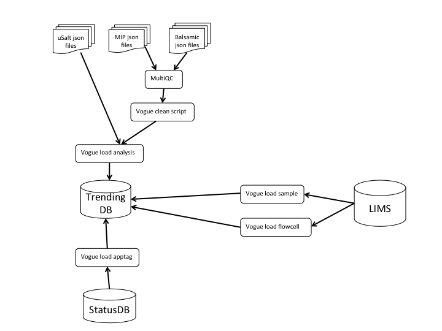

# vogue (**version** = 0.2.0)

Vogue is Clinical Genomics solution for capturing data from various places in the data flow and to trend the data over a longer period of time.

## Installation


```bash
git clone https://github.com/Clinical-Genomics/vogue.git
cd vogue
pip install -e .
```

## Front End
All views in vogue should be self-explanatory. There should be no further documentation needed to be able to interpret the content of the web page.

## Back End
The trending database is a Mongo database consisting of following collections:

- **sample** - holds LIMS specific data on sample level. Anchoring identifier are LIMS sample ids.
- **sample_analysis** - holds data from diferent pipeliens on sample level. Anchoring identifier are lims sample ids.
- **flowcell** - holds lims specific data on run level. Anchoring identifier are flowcell ids.
- **application_tag** - holds application tag specific data. Anchoring identifier are application tags.

The load command of each collection is described below.

## Data Flow
<p align="center">
		
</p>

## CLI
The CLI has two base commands - load and run. The load command is for loading various data into the trending database, and the run command is for running the web application.

### Load sample
```
Usage: vogue load sample [OPTIONS]

  Read and load lims data for one or all samples. When loading many
  smaples, the different options -f, -n, -d are used to delimit the subset
  of samples to load.

Options:
  -s, --sample-lims-id TEXT  Input sample lims id
  -m, --many                 Load all lims samples if no other options are
                             selected
  --dry                      Load from sample or not. (dry-run)
  -f, --load-from TEXT       load from this sample lims id. Use if load all
                             broke. Start where it ended
  -n, --new                  Use this flag if you only want to load samples
                             that dont exist in the database
  -d, --date TEXT            Update only samples delivered after date
  --help                     Show this message and exit.
  ```
  
  ### Load analysis
  ```
  Usage: vogue load analysis [OPTIONS]

  Read and load analysis results. These are either QC or analysis output
  files.

  The input are unique IDs with an analysis config file (JSON/YAML) which
  includes analysis results matching the analysis model. Analysis types
  recognize the following keys in the input file: QC:multiqc_picard_dup,
  multiqc_picard_HsMetrics, multiqc_picard_AlignmentSummaryMetrics,
  multiqc_picard_insertSize

Options:
  -s, --sample-id TEXT          Input sample id  [required]
  -a, --analysis-config PATH    Input config file. Accepted format: JSON, YAML
                                [required]
  -t, --analysis-type [QC|all]  Type of analysis results to load.
  --dry                         Load from sample or not. (dry-run)
  --help                        Show this message and exit.
  ```
  
  ### Load flowcell
  
  ```
  Usage: vogue load flowcell [OPTIONS]

  Read and load lims data for one or all runs

Options:
  -r, --run-id TEXT  Flowcell id. Eg: 190315_D00410_0873_BHWWKCBCX2
  -a, --all-runs     Load all flowcells found in LIMS.
  --dry              Load from flowcell or not. (dry-run)
  --help             Show this message and exit.
  ```
  
  ### Load apptag
  
  ```
  Usage: vogue load apptag [OPTIONS] APPLICATION_TAGS

  Reads json string with application tags. Eg:'[{"tag":"MELPCFR030",
  "category":"wgs",...},...]'

Options:
  --help  Show this message and exit.
  ```
  
### Run


